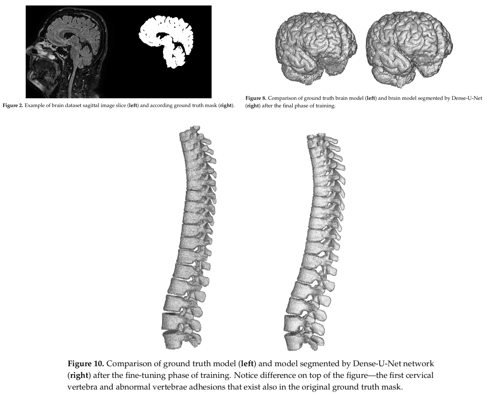

# 3D Dense U-Net
### Optimized High Resolution 3D Dense-U-Net Network for Brain and Spine Segmentation

### Model Schema

### Examples

### About
This repository contains the implementation of [Optimized High Resolution 3D Dense-U-Net Network for Brain and Spine Segmentation](https://www.mdpi.com/2076-3417/9/3/404)
using tensorflow and keras.

### Authors
Paper:
* Martin Kolařík - Department of Telecommunications, Brno University of Technology
* Radim Burget - Department of Telecommunications, Brno University of Technology
* Václav Uher - Department of Telecommunications, Brno University of Technology
* Kamil Říha - Department of Telecommunications, Brno University of Technology
* Malay Kishore Dutta - Centre for Advanced Studies, Dr. A.P.J. Abdul Kalam Technical University

Codebase:
* [Milad Sadeghi DM](https://elns.ir) - EverLookNeverSee@GitHub

## License
This project licensed under the MIT License - see the [LICENSE](LICENSE) file for more details.
